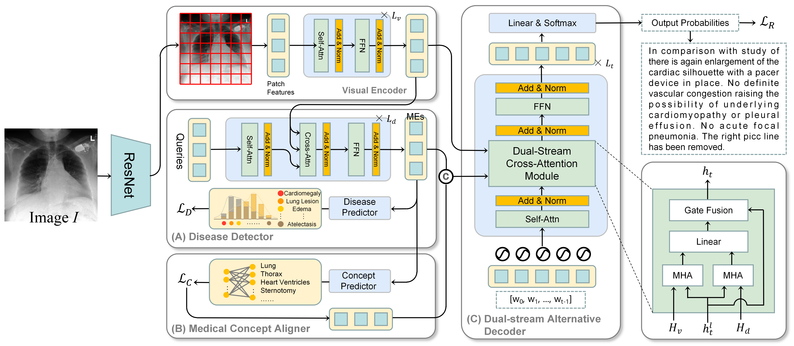

# REAP

This is the repository of _Improving Radiology Report Generation with Explicit Abnormality Prediction_.

## Requirements

- `torch==1.7.1`
- `torchvision==0.8.2`
- `opencv-python==4.4.0.42`

## Download REAP

We will release weight files later.

## Datasets

We use two datasets (IU X-Ray and MIMIC-CXR) in our paper.

For `IU X-Ray`, you can download the dataset
from [here](https://drive.google.com/file/d/1c0BXEuDy8Cmm2jfN0YYGkQxFZd2ZIoLg/view?usp=sharing) and then put the files
in `data/iu_xray`.

For `MIMIC-CXR`, you can download the dataset from [here](https://physionet.org/content/mimic-cxr/2.0.0/) and then put
the files in `data/mimic_cxr`.

NOTE: The `IU X-Ray` dataset is of small size, and thus the variance of the results is large.
There have been some works using `MIMIC-CXR` only and treating the whole `IU X-Ray` dataset as an extra test set.

## Usage

see _shells.sh_ to get the command for train and test

